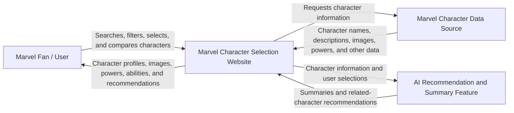

# Marvel Character Selection Project

## Project Description

Our CSC325 capstone project is a **Marvel Character Selection Website** designed for Marvel fans who want an easy way to search for, explore, compare, and select Marvel characters.

The current problem is that information about Marvel characters is often spread across many different websites, making it difficult for users to quickly find character descriptions, powers, abilities, images, and other important information in one organized place.

Our project will solve this problem by creating a simple and user-friendly website where users can search for Marvel characters, view detailed character profiles, browse powers and abilities, compare characters, save or select characters they are interested in, and receive AI-assisted character recommendations and summaries.

The target audience is Marvel fans, casual viewers, comic readers, and users who want to learn more about Marvel characters without searching through multiple websites.

The goal of the project is to create an organized and visually appealing experience that makes discovering and learning about Marvel characters faster, easier, and more enjoyable.

---

## Context Diagram

### Context Diagram Description

The primary user of the system is the **Marvel Fan/User**. The user interacts with the Marvel Character Selection Website by searching for characters, browsing character information, filtering results, comparing characters, and selecting characters they are interested in.

The website receives character information from a **Marvel Character Data Source**, which provides information such as character names, descriptions, powers, abilities, and images.

The website also communicates with an **AI Recommendation and Summary Feature**. The AI feature helps summarize character information and recommend similar characters based on the character the user is currently viewing or selecting.

---

# Product Backlog

## Epic 1: Character Search and Discovery

### User Story 1.1 - Search for a Marvel Character

**WHO:** Marvel fan  
**WHAT:** Search for a Marvel character by name  
**WHY:** So that I can quickly find the character I want to learn about.

#### Acceptance Criteria

1. **Given** I am on the character search page,  
   **When** I enter a valid Marvel character name and submit the search,  
   **Then** the system displays matching characters.

2. **Given** multiple characters match my search,  
   **When** the search results are displayed,  
   **Then** each result shows the character's name and image when available.

3. **Given** no character matches my search,  
   **When** I submit the search,  
   **Then** the system displays a clear message telling me that no matching character was found.

---

### User Story 1.2 - Browse Marvel Characters

**WHO:** Marvel fan  
**WHAT:** Browse a list of Marvel characters  
**WHY:** So that I can discover characters even when I do not know exactly who I want to search for.

#### Acceptance Criteria

1. **Given** I open the character browsing page,  
   **When** the character list loads,  
   **Then** I can see multiple Marvel characters.

2. **Given** character information is available,  
   **When** characters are displayed,  
   **Then** each character includes at least a name and an image when available.

3. **Given** there are more characters than can comfortably fit on one screen,  
   **When** I continue browsing,  
   **Then** I can access additional characters without losing my place unexpectedly.

---

### User Story 1.3 - Filter Character Results

**WHO:** Marvel fan  
**WHAT:** Filter character results  
**WHY:** So that I can narrow down the list and find characters more easily.

#### Acceptance Criteria

1. **Given** I am viewing a list of Marvel characters,  
   **When** I apply an available filter,  
   **Then** the displayed results update to match the selected filter.

2. **Given** I have applied multiple filters,  
   **When** the results are updated,  
   **Then** only characters matching the selected criteria are displayed.

3. **Given** filters are currently active,  
   **When** I clear the filters,  
   **Then** the full character list is displayed again.

---

## Epic 2: Character Profiles and Information

### User Story 2.1 - View Character Description

**WHO:** Marvel fan  
**WHAT:** View a detailed description of a selected character  
**WHY:** So that I can learn about the character's background and identity.

#### Acceptance Criteria

1. **Given** I select a character,  
   **When** the character profile opens,  
   **Then** the character's name and description are displayed.

2. **Given** additional character information is available,  
   **When** I view the profile,  
   **Then** the information is organized into clearly labeled sections.

3. **Given** a description is unavailable,  
   **When** I open the character profile,  
   **Then** the website displays a message stating that the information is currently unavailable instead of displaying incorrect information.

---

### User Story 2.2 - View Powers and Abilities

**WHO:** Marvel fan  
**WHAT:** View a character's powers and abilities  
**WHY:** So that I can understand what makes the character unique.

#### Acceptance Criteria

1. **Given** I am viewing a character profile,  
   **When** power and ability information is available,  
   **Then** the website displays the character's known powers and abilities.

2. **Given** a character has multiple powers or abilities,  
   **When** the information is displayed,  
   **Then** the abilities are organized in an easy-to-read format.

3. **Given** power information is unavailable,  
   **When** I open that section,  
   **Then** the website clearly states that the information is unavailable.

---

### User Story 2.3 - View Character Images

**WHO:** Marvel fan  
**WHAT:** View images of a selected Marvel character  
**WHY:** So that I can visually identify the character.

#### Acceptance Criteria

1. **Given** a character image is available,  
   **When** I open the character profile,  
   **Then** the character image is displayed.

2. **Given** an image is displayed,  
   **When** the page loads on different screen sizes,  
   **Then** the image remains properly sized and does not cover important text.

3. **Given** no image is available for a character,  
   **When** I view the profile,  
   **Then** the website displays a placeholder instead of a broken image.

---

## Epic 3: Character Selection and Comparison

### User Story 3.1 - Select a Character

**WHO:** Marvel fan  
**WHAT:** Select a Marvel character  
**WHY:** So that I can keep track of the character I am currently interested in.

#### Acceptance Criteria

1. **Given** I am viewing a character,  
   **When** I click the Select button,  
   **Then** the character is marked as selected.

2. **Given** I have selected a character,  
   **When** I continue using the website,  
   **Then** the interface clearly identifies which character is selected.

3. **Given** I no longer want a character selected,  
   **When** I remove or change my selection,  
   **Then** the website updates the selection correctly.

---

### User Story 3.2 - Compare Marvel Characters

**WHO:** Marvel fan  
**WHAT:** Compare two Marvel characters  
**WHY:** So that I can easily see differences between their information, powers, and abilities.

#### Acceptance Criteria

1. **Given** I have chosen two characters,  
   **When** I select the comparison option,  
   **Then** both characters are displayed together.

2. **Given** the comparison page is displayed,  
   **When** information is available for both characters,  
   **Then** their names, descriptions, powers, and other supported information are shown in clearly separated sections.

3. **Given** information is missing for one character,  
   **When** I compare the characters,  
   **Then** the website identifies the missing information instead of creating or assuming data.

---

### User Story 3.3 - Save Favorite Characters

**WHO:** Marvel fan  
**WHAT:** Save characters as favorites  
**WHY:** So that I can quickly return to characters I like.

#### Acceptance Criteria

1. **Given** I am viewing a character profile,  
   **When** I choose to add the character to my favorites,  
   **Then** the character is added to my favorites list.

2. **Given** a character is already in my favorites,  
   **When** I attempt to add the same character again,  
   **Then** the system prevents duplicate favorite entries.

3. **Given** a character is in my favorites list,  
   **When** I choose to remove the character,  
   **Then** the character is removed from the list.

---

## Epic 4: AI-Assisted Character Features

### User Story 4.1 - AI Character Summary

**WHO:** Marvel fan  
**WHAT:** Receive an AI-generated summary of a Marvel character  
**WHY:** So that I can quickly understand the most important information about the character.

#### Acceptance Criteria

1. **Given** character information is available,  
   **When** I request an AI summary,  
   **Then** the system generates a short and readable summary based on the available character information.

2. **Given** the AI generates a summary,  
   **When** the summary is displayed,  
   **Then** it is clearly identified as AI-assisted content.

3. **Given** there is not enough reliable information to create a useful summary,  
   **When** the AI feature is requested,  
   **Then** the system informs the user instead of intentionally inventing missing character information.

---

### User Story 4.2 - AI Character Recommendations

**WHO:** Marvel fan  
**WHAT:** Receive recommendations for similar Marvel characters  
**WHY:** So that I can discover new characters related to characters I already like.

#### Acceptance Criteria

1. **Given** I am viewing or have selected a Marvel character,  
   **When** I request recommendations,  
   **Then** the AI feature suggests related or similar Marvel characters.

2. **Given** recommendations are displayed,  
   **When** I select a recommended character,  
   **Then** I am taken to that character's profile.

3. **Given** the AI recommends a character,  
   **When** the recommendation is displayed,  
   **Then** the website provides a short explanation of why the character may be related or similar.

---

### User Story 4.3 - Ask AI About a Character

**WHO:** Marvel fan  
**WHAT:** Ask questions about the selected Marvel character  
**WHY:** So that I can learn more without manually searching through every section of the profile.

#### Acceptance Criteria

1. **Given** I am viewing a character profile,  
   **When** I ask a supported question about the character,  
   **Then** the AI provides a response based on available character information.

2. **Given** the answer depends on information that is not available,  
   **When** the AI responds,  
   **Then** it communicates that limitation instead of presenting uncertain information as confirmed fact.

3. **Given** the AI provides an answer,  
   **When** I read the response,  
   **Then** the AI response is visually separated from the website's normal character information.

---

## Epic 5: User Experience, Accessibility, and Reliability

### User Story 5.1 - Responsive Website Design

**WHO:** Marvel fan  
**WHAT:** Use the website on different screen sizes  
**WHY:** So that I can access the website from a desktop, laptop, tablet, or phone.

#### Acceptance Criteria

1. **Given** I open the website on a desktop computer,  
   **When** the page loads,  
   **Then** the website content fits correctly within the screen.

2. **Given** I open the website on a smaller mobile screen,  
   **When** the page loads,  
   **Then** important text, images, buttons, and navigation remain usable.

3. **Given** the browser window changes size,  
   **When** the layout adjusts,  
   **Then** major interface elements do not overlap or become unreadable.

---

### User Story 5.2 - Easy Website Navigation

**WHO:** Marvel fan  
**WHAT:** Easily navigate between the main sections of the website  
**WHY:** So that I can find the information I want without becoming confused.

#### Acceptance Criteria

1. **Given** I am using the website,  
   **When** I view the navigation menu,  
   **Then** the major sections of the website are clearly labeled.

2. **Given** I select a navigation option,  
   **When** the page changes,  
   **Then** I am taken to the expected section.

3. **Given** I am viewing a character profile or another page,  
   **When** I want to return to the main browsing or search area,  
   **Then** I can do so using the website navigation without using the browser's Back button.

---

### User Story 5.3 - Handle Errors Clearly

**WHO:** Marvel fan  
**WHAT:** Receive understandable error messages when something goes wrong  
**WHY:** So that I know what happened and what I can do next.

#### Acceptance Criteria

1. **Given** character data cannot be loaded,  
   **When** an error occurs,  
   **Then** the website displays a clear error message.

2. **Given** one part of the website fails to load,  
   **When** possible,  
   **Then** the rest of the website remains usable.

3. **Given** an error may be temporary,  
   **When** the error message is displayed,  
   **Then** the website provides an option to retry or return to another section.

---

# AI Feature

The AI feature in our Marvel Character Selection Website will assist users by providing **character summaries, related-character recommendations, and answers to supported questions about characters**.

The AI feature is intended to improve discovery and make character information easier to understand. AI-generated information will be clearly identified as AI-assisted content. The system should rely on available character information and should communicate when information is unavailable instead of presenting uncertain information as confirmed fact.

The AI feature will support the website rather than replace the main character information and data used by the project.

---

# Sanity Check

This Product Backlog contains **5 Epics**.

Each Epic contains **at least 3 User Stories**.

Each User Story contains **at least 3 Acceptance Criteria written using Given, When, and Then**.

The project description identifies the target audience, the problem being solved, and the information and activities the website will provide.

The Context Diagram identifies the system and the external actors or services that interact with it.

The project also includes an **AI feature**, as requested in the professor's feedback.
